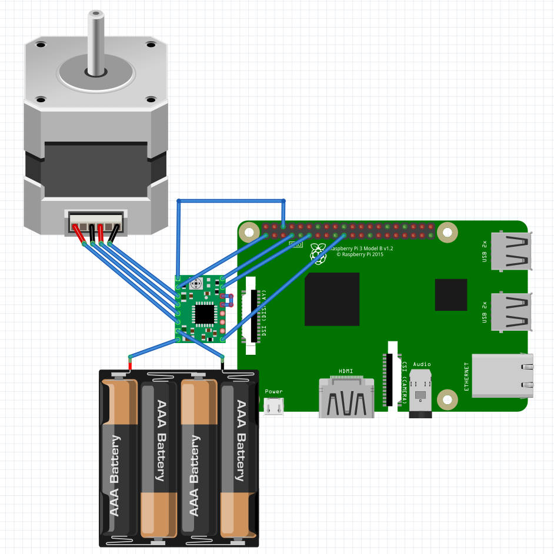

# stepper-motor-test-raspberry
Simple stepper motor tester for raspberry pi

## Usage

There are no additional dependencies. Just compile it using G++, and it will be ready to work.

You can switch between old RPi and new one by commenting/uncommenting lines 59 and 60 in [main.cpp](main.cpp#L59)

There are parameters you can set from command line interface:

* dir - direction pin
* en - enable pin
* step - step pin
* distance - number of steps. Can be negative
* delay - delay between ticks in microseconds

For example (compile and run):

```bash
g++ main.cpp -o test
sudo ./test delay 60 distance 100000
```

## Default connection

You can connect stepstick to motor in the following way. This is the default:


